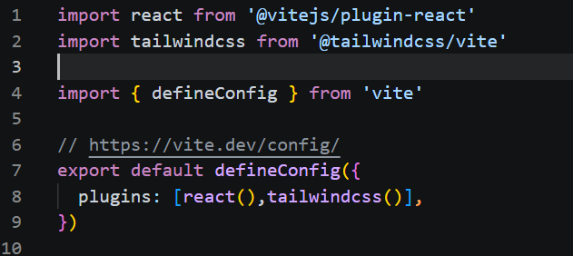

# Project setup

1. create two folder frontend and backend
2. go to frontend `cd frontend`
    - type `npm create vite@latest`
    - press `Y` if asked to install
    - enter `.` in project name
    - select 'react' as framework from arrow key
    - select JavaScript from variant by arrow key
    - select ESLint by arrow key
    - select Yes and press enter

3. setup tailwind in react project 
   - install tailwind css using `npm install tailwindcss @tailwindcss/vite`
   - open vite.config.js as below image 
   
  
   - remove all contents of index.css then write 
      `@import "tailwindcss"` on top of index.css

4. in react style can be added into html by "clasaName" because class is a predefined keyword in react 
5. when js function returns directly html contents , called component
    1. start with capital letter
    2. it must return html 
    3. must be closed at the calling time 
    4. it can be used anywhere and anytime 
  - <>

    </> // called as fragment used in place of 
    